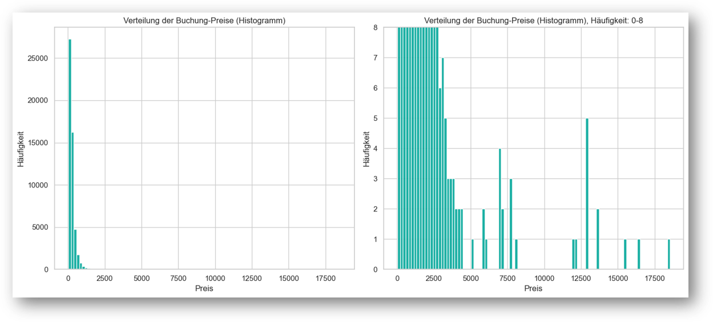
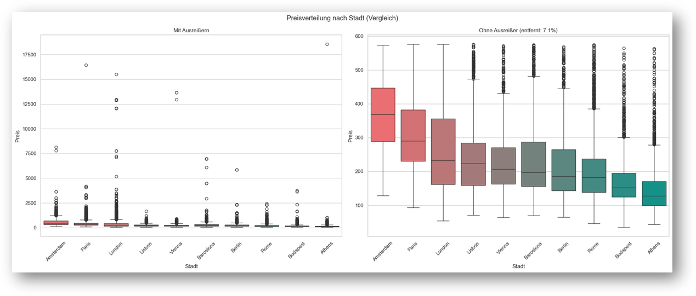
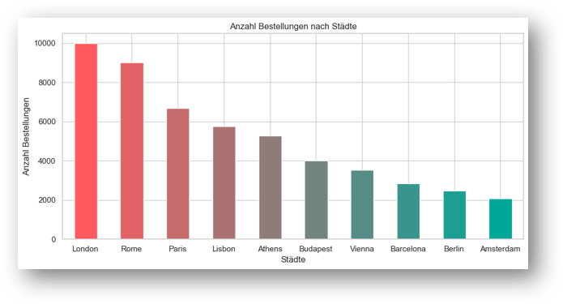
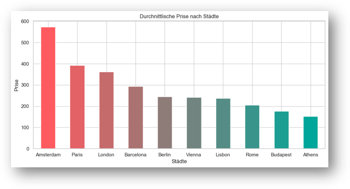
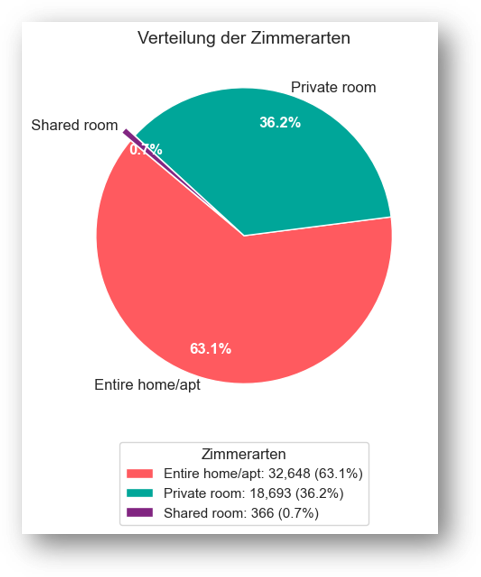
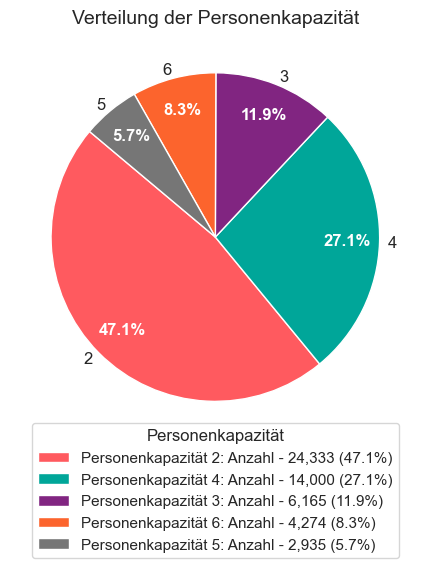
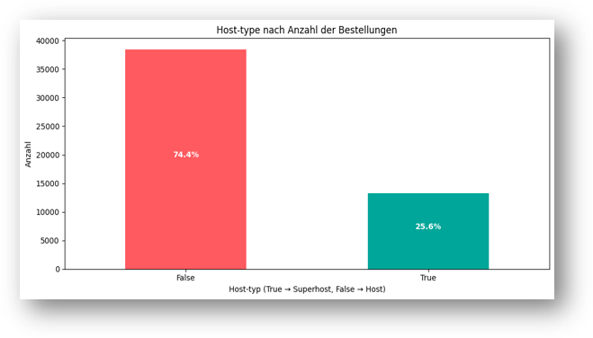
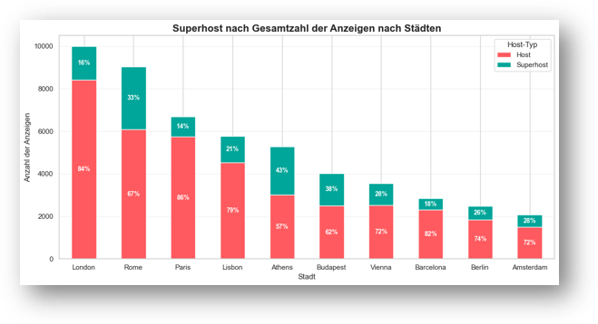
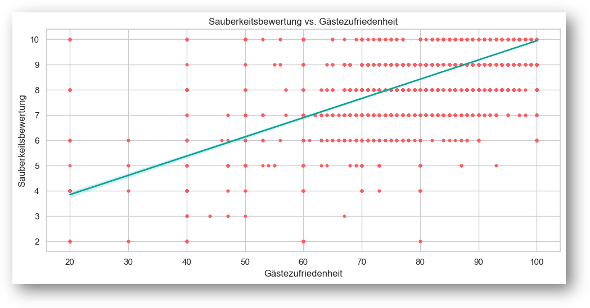
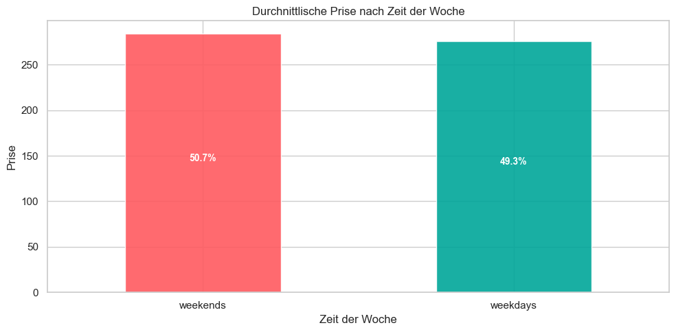

# 🏠 Airbnb Python Price Analysis

## Projektübersicht

Dieses Projekt wurde im Rahmen des Moduls **Python für Datenanalysten** durchgeführt.

Ziel der Analyse war die Untersuchung von Airbnb-Angeboten in europäischen Städten, um Preisstrukturen, Einflussfaktoren auf Übernachtungspreise sowie Zusammenhänge zwischen Unterkunftsmerkmalen und Kundenzufriedenheit zu identifizieren.

Die Analyse wurde vollständig in Python durchgeführt und umfasst Datenaufbereitung, explorative Datenanalyse (EDA), Visualisierung sowie die Ableitung geschäftsrelevanter Erkenntnisse.

---

## Fragestellung

Im Mittelpunkt der Untersuchung standen folgende Fragen:

* Welche Faktoren beeinflussen den Preis einer Airbnb-Unterkunft?
* Wie unterscheiden sich Preise zwischen verschiedenen Unterkunftstypen?
* Welchen Einfluss haben Kapazität und Gastgebermerkmale auf den Preis?
* Besteht ein Zusammenhang zwischen Kundenzufriedenheit und Preisniveau?
* Unterscheiden sich Preise zwischen Wochenenden und Wochentagen?

---

## Datensatz

Verwendet wurde ein Airbnb-Datensatz mit Informationen zu:

* Unterkunftspreisen
* Unterkunftstypen
* Gastgebermerkmalen
* Kapazitäten
* Bewertungen
* Kundenzufriedenheit
* Standortinformationen

Datengrundlage:

```text
data/airbnb_full.csv
```

---

## Datenaufbereitung

Vor der Analyse wurden die Daten bereinigt und vorbereitet:

* Prüfung auf fehlende Werte
* Datentyp-Korrekturen
* Entfernung fehlerhafter Einträge
* Erstellung zusätzlicher Analysevariablen
* Standardisierung relevanter Merkmale

---

## Verwendete Technologien

### Programmiersprache

* Python

### Bibliotheken

* Pandas
* NumPy
* Matplotlib
* Seaborn
* Jupyter Notebook

### Entwicklungsumgebung

* Jupyter Notebook
* Visual Studio Code
* Git
* GitHub

---

## Explorative Datenanalyse

### Preisverteilung

Analyse der Verteilung von Airbnb-Preisen sowie Identifikation von Ausreißern.

**Abbildung 1: Preisverteilung (Histogramm)**



**Abbildung 2: Preisverteilung (Boxplot)**



---

### Marktanalyse

Vergleich verschiedener Marktsegmente und Unterkunftsarten.





---

### Kapazitätsanalyse

Untersuchung des Zusammenhangs zwischen Unterkunftsgröße und Preisniveau.

<p align="center">
  
  
</p>

---

### Gastgeberanalyse

Analyse von Gastgebermerkmalen und deren Einfluss auf die Preisgestaltung.





---

### Kundenzufriedenheit

Untersuchung möglicher Zusammenhänge zwischen Preis und Zufriedenheit.



---

### Wochenend- vs. Wochentagspreise

Vergleich der Preisstrukturen zwischen Wochenenden und regulären Wochentagen.



---

## Zentrale Erkenntnisse

Die Analyse zeigt mehrere relevante Zusammenhänge:

* Größere Unterkünfte weisen im Durchschnitt höhere Preise auf.
* Bestimmte Unterkunftstypen erzielen deutlich höhere Marktpreise.
* Preise unterscheiden sich zwischen Wochenenden und Wochentagen.
* Kundenzufriedenheit steht nicht zwangsläufig in direktem Zusammenhang mit höheren Preisen.
* Gastgebermerkmale beeinflussen die Preisgestaltung messbar.

---

## Projektstruktur

```text
airbnb-python-price-analysis
│
├── data/
│   └── airbnb_full.csv
│
├── images/
│   ├── capacity_analysis_1.png
│   ├── capacity_analysis_2.png
│   ├── host_analysis.png
│   ├── market_analysis.png
│   ├── price_distribution_1.png
│   ├── price_distribution_2.png
│   ├── satisfaction_correlation.png
│   └── weekend_vs_weekday.png
│
├── notebooks/
│   └── airbnb_analyse_Nataliia_Melnytska.ipynb
│
├── presentation/
│   └── airbnb_analyse_praesentation.pdf
│
├── .gitignore
└── README.md
```

---

## Handlungsempfehlungen

Aus den Analyseergebnissen lassen sich folgende Empfehlungen ableiten:

* Preisstrategien sollten Unterkunftsgröße und Kapazität berücksichtigen.
* Gastgeber können durch gezielte Optimierung ihrer Angebote höhere Marktpreise erzielen.
* Wochenendpreise bieten Potenzial für zusätzliche Umsatzsteigerungen.
* Kundenzufriedenheit sollte unabhängig von der Preisgestaltung kontinuierlich verbessert werden.

---

## Mögliche Weiterentwicklung

Zukünftige Erweiterungen des Projekts könnten umfassen:

* Entwicklung eines Preisprognose-Modells mit Machine Learning
* Analyse saisonaler Effekte
* Geografische Preisanalysen mit Kartenvisualisierung
* Vergleich verschiedener europäischer Städte
* Automatisierte Dashboard-Lösung mit Streamlit oder Power BI

---

## Autorin

**Nataliia Melnytska**

Projekt im Rahmen des Moduls **Python für Datenanalysten**.
